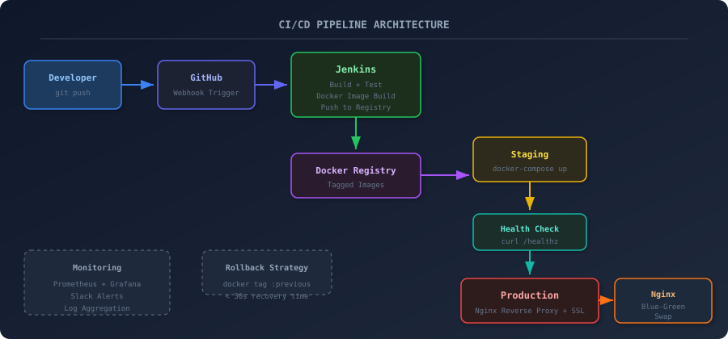

# How I Built a Zero-Downtime CI/CD Pipeline with Jenkins, Docker, and Nginx

A detailed walkthrough of building a production CI/CD pipeline with blue-green deployments, automated rollbacks, and zero downtime — from someone who learned the hard way after a Friday deploy took down the app for 40 minutes.

## Architecture

## Background

I still remember the Friday evening when I pushed a "small fix" directly to production. The app went down. For 40 minutes. On a Friday. My phone was blowing up with alerts and I was frantically SSH-ing into the server trying to figure out what went wrong. Turns out, the new container started before the old one fully stopped, there was a port conflict, and Nginx was routing traffic to a dead upstream.

That night I decided: never again. I was going to build a proper CI/CD pipeline with zero-downtime deployments, automated health checks, and instant rollbacks. This post is the result of about three weeks of iterations, late nights, and a lot of `docker logs` commands.

## Topics

`DevOps` · `CI/CD` · `Jenkins` · `Docker` · `Nginx` · `Linux`

## Repo contents

Artifacts and configs from the build:

- **root** — docker-compose.jenkins.yml, Jenkinsfile
- **configs/** — config.json
- **monitoring/** — prometheus.yml
- **nginx/etc/nginx/conf.d/** — app.conf
- **scripts/** — script.sh, script-2.sh
- **scripts/app/** — health.py

## Read the full write-up

[reshamchaudhary.com/blog/zero-downtime-cicd-jenkins-docker](https://reshamchaudhary.com/blog/zero-downtime-cicd-jenkins-docker)

The blog post has the full walkthrough — the design decisions, debugging stories, performance numbers, and the lessons that didn't make it into the configs.
